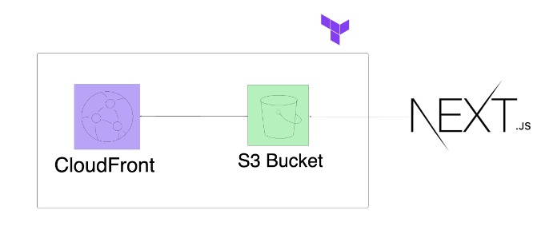

# Deplopy NextJs application to AWS Infastructure using Terraform

# Project Overview

This project demonstrates the deployment of a NextJS application on AWS using Terraform for infrastructure as code. It showcases how to create a scalable, secure, and highly available web application infrastructure, putting various cloud and DevOps concepts into practice.

James Smith, a freelance web designer, wants to showcase his work and attract potential clients through an online portfolio. He has designed a modern, responsive single-page website using the Next.js framework. James requires this website to be hosted on a robust, scalable, and cost-effective platform. Additionally, the website needs to be highly available and deliver fast loading times for a global audience.

My task is to deploy James's Next.js portfolio website on AWS using Infrastructure as Code (IaC) principles with Terraform. This project will give me hands-on experience with Terraform, S3, and CloudFront, mimicking a real-world deployment scenario.

## Table of Contents

1. [Architecture](#architecture)
2. [Project Demonstration Videos](#project-demonstration-videos)
3. [Prerequisites](#prerequisites)
4. [Project Structure](#project-structure)
5. [Setup and Deployment](#setup-and-deployment)
6. [Infrastructure Components](#infrastructure-components)
7. [Customization](#customization)
8. [Troubleshooting](#troubleshooting)
9. [Cleaning Up](#cleaning-up)
10. [Furture Steps](#future-steps)

## Architecture

Below is the high-level architecture of my NextJS application infrastructure:



This architecture leverages S3 and Cloud Front to create a robust, scalable, and secure hosting environment for a NextJS application.

## Project Demonstration Videos

1. Initial NextJS Setup: [Watch the video](https://www.loom.com/share/87e3c808711f4c91b09cb0c893a8a7a5)
   This video covers the initial setup of the NextJS application.

## Prerequisites

Before you begin, ensure you have the following:

- AWS CLI installed and configured with appropriate credentials
- Terraform installed (version 1.0.0 or later)
- Git for version control
- Node.js and npm (for NextJS development)
- A NextJS application ready for deployment

## Project Structure

- `main.tf`: Primary Terraform configuration
- `outputs.tf`: Output value definitions
- `state.tf`: State management setup
- `nextjs-blog/`: Directory containing the NextJS application

## Setup and Deployment

1. Clone the repository:
   git clone Your Repository URL

   ```bash
    git clone ttps://github.com/DylanCorr2020/terraform-portfolio-project.git
   ```

   cd Your Project Directory

2. Initialize Terraform:
   terraform init

3. Review the planned changes:
   terraform plan

4. Apply the Terraform configuration:
   terraform apply

5. Confirm the changes by typing `yes` when prompted.

6. You will to then uplaod the next.js application files to your S3 bucket

```bash
   aws s3 sync ../nextjs-blog/out s3://myblog-tf-bucket
```

Make sure you are feeding the right path... and s3:// is your S3 bucket name

7. After successful application, you should see the S3 bucket created with your NextJS application files:

## Infastructure Components

### S3 Bucket

- Used for hosting static website files
- Configured with appropriate bucket policies for security

### CloudFront Distribution

- Provides global content delivery
- Improves latency and performance for users worldwide

### DynamoDB

- Used for Terraform state locking
- Prevents concurrent modifications to the infrastructure

## Customization

1. Update `main.tf` to add or modify resources as needed.
2. If you need to adjust the NextJS application, update it in the `nextjs-app/` directory and redeploy.

## Troubleshooting

If you see an access denied page when accessing your CloudFront URL:

This could be due to misconfigured bucket policies or CloudFront settings. Double-check your S3 bucket policy and CloudFront distribution
settings.

## Cleaning Up

To destroy the created resources and avoid unnecessary AWS charges:
terraform destroy

Confirm the destruction by typing `yes` when prompted.

## Future Steps

As this project continues to evolve, I plan to enhance the following:

1. **Implementing CI/CD Pipeline**

   - Integrate with Jenkins or GitHub Actions for automated testing and deployment
   - Set up automatic deployment triggers on code pushes to specific branches
   - Implement staged deployments (dev, staging, production)

2. **AWS Resource Reconfiguration**

   - Optimize S3 bucket settings for improved performance and cost-efficiency
   - Enhance CloudFront distribution settings for better caching and security
   - Implement AWS WAF for additional security layers
